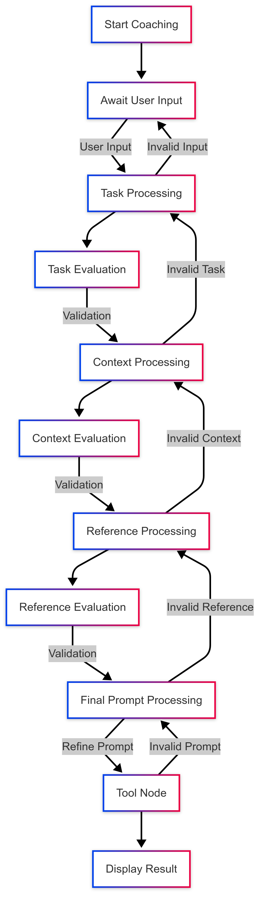
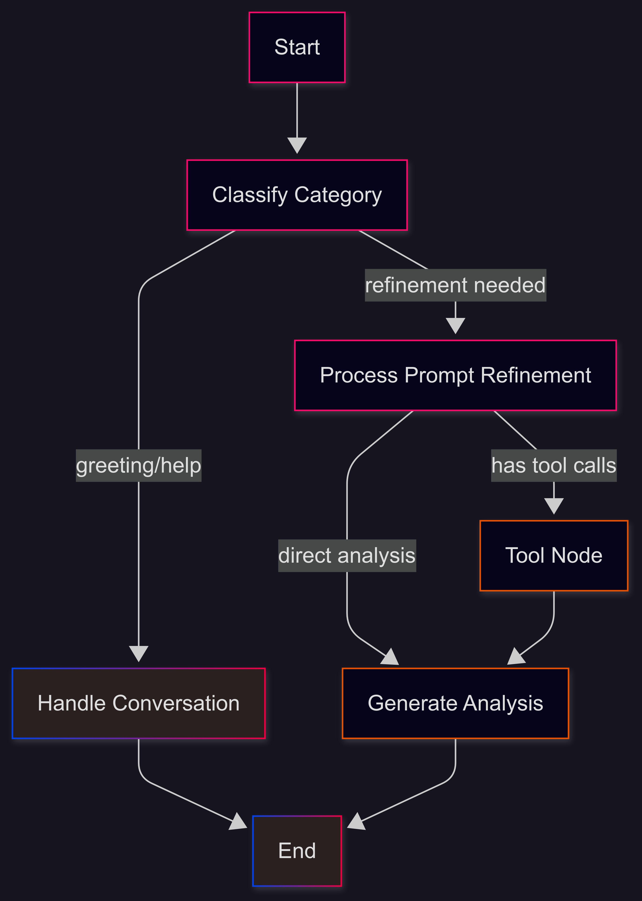

# Prompt-Engine Application

> **Disclaimer**
>
> This evaluation was conducted by using ChatGPT to research prompt engineering problems on Reddit. The insights gathered helped me to define the solution this application offers clearly and refined my vision.

## Overview

The Prompt Engine is a **dual-agent application** designed to solve common problems users face with prompt engineering (identified from Reddit discussions and industry practice).

**Refiner Agent:** Automatically rewrites user prompts into effective, structured versions using best frameworks.

**Coach Agent:** Teaches users why those refinements matter, building long-term skill in effective prompting.

This creates both instant utility (better prompts now) and user growth (learn prompting strategies for future tasks).

## Core Problems to Solve

This is a list of problems gathered from Reddit with how they impacted tyhe user and expected solution the application is to solve

| Problem spotted on Reddit | What users are doing wrong |
|---------|-------------|
| Prompts are bloated/verbose and worse for it. ([Reddit][1]) | "More words = more control." |
| Overloaded context (token dilution). ([Reddit][3]) | Stuffing backstory/history into every call. |
| No role framing/persona. ([Reddit][3]) | Leaving the model "default." |
| Hallucinations & weak verification. ([Anthropic][6], [Business Insider][7]) | Asking for confident answers without checks. |
| Lack of engineering rigor; cargo-culting prompts. ([Reddit][10]) | Copying "magic prompts" w/o evals. |
| Hard to scale agents; monolithic prompts. ([Reddit][4]) | One mega-prompt does planning+execution+memory. |
| Repetition from "anchor language." ([Reddit][11]) | Reusing same scaffolding words → repetitive outputs. |
| Users think "prompting is dead; just add context." ([Reddit][12]) | Ignoring instructions/format requests. |
| Evaluation difficulty/reproducibility. ([Reddit][13]) | No way to know if a change helped. |
| Confusion over when to reason step-by-step. ([Prompting Guide][14]) | Either never ask for reasoning or always force it. |

[1]: https://www.reddit.com/r/PromptEngineering/comments/1kotrro/some_of_the_most_common_but_huge_mistakes_i_see/?utm_source=chatgpt.com "some of the most common but huge mistakes i see here"
[3]: https://www.reddit.com/r/PromptEngineering/comments/1mai2a1/prompt_engineering_debugging_the_10_most_common/?utm_source=chatgpt.com "Prompt Engineering Debugging: The 10 Most Common ..."
[4]: https://www.reddit.com/r/PromptEngineering/comments/1kbkrkf/5_common_mistakes_when_scaling_ai_agents/?utm_source=chatgpt.com "5 Common Mistakes When Scaling AI Agents"
[6]: https://docs.anthropic.com/en/docs/build-with-claude/prompt-engineering/overview?utm_source=chatgpt.com "Prompt engineering overview"
[7]: https://www.businessinsider.com/anthropic-guide-prompt-engineering-2025-7?utm_source=chatgpt.com "Here's how to write an effective AI prompt, according to Anthropic"
[10]: https://www.reddit.com/r/PromptEngineering/comments/1i0o5fk/prompt_engineering_lacks_engineering_rigor/?utm_source=chatgpt.com "Prompt engineering lacks engineering rigor"
[11]: https://www.reddit.com/r/PromptEngineering/comments/1mfxwwk/prompt_engineering_debugging_the_10_most_common/?utm_source=chatgpt.com "Prompt Engineering Debugging: The 10 Most Common ..."
[12]: https://www.reddit.com/r/PromptEngineering/comments/1ic8c43/prompt_engineering_is_overrated_ais_just_need/?utm_source=chatgpt.com "Prompt Engineering is overrated. AIs just need context now"
[13]: https://www.reddit.com/r/PromptEngineering/comments/1adwpk9/what_are_the_greatest_challenges_in_prompt/?utm_source=chatgpt.com "What are the greatest challenges in Prompt Engineering?"
[14]: https://www.promptingguide.ai/techniques/cot?utm_source=chatgpt.com "Chain-of-Thought (CoT) Prompting"

## Solution Overview

The Prompt Engine addresses these challenges through a **two-agent architecture** that combines immediate results with educational guidance:

### 1. **Coach Agent**

<table>
<tr>
<td width="60%">

**Guided Learning Approach**

The Coach Agent solves the **"lack of engineering rigor"** problem by teaching users a structured methodology following:

- **Task (Persona + Format) → Context → References → Evaluate → Iterate** framework
- **Automatic grammar correction** at each step for clarity
- **Intelligent evaluation** that guides users through proper prompt construction
- **Educational feedback** that builds long-term prompting skills
- **Linear workflow** that prevents the common mistake of "stuffing everything into one prompt"

It makes sure the user masters the art of **Prompt Engineering** through strictly going through all the steps.

*See detailed agent flow: [Coach Agent Mermaid Diagram](backend/graphs/coach_agent_mermaid.png)*

</td>
<td width="40%">

</td>
</tr>
</table>

### 2. **Refiner Agent**

<table>
<tr>
<td width="40%">

</td>
<td width="60%">

**Instant Expert Refinement**

The Refiner Agent solves **"cargo-culting prompts"** and **"verbosity issues"** through intelligent categorization:

- **Automatic prompt analysis** determines the best refinement approach
- **Framework-based refinement** using proven methodologies (C.O.R.E., R.A.C.E., C.A.R., etc.)
- **Category-specific optimization** for clarity, precision, or creativity needs
- **RAG integration** for document-aware prompt enhancement

*See detailed agent flow: [Refiner Agent Mermaid Diagram](backend/graphs/refiner_agent_mermaid.png)*

</td>
</tr>
</table>

**Available Categories & Frameworks:**

- **Clarity** (4 frameworks): Structure & organization issues
- **Precision** (2 frameworks): Technical accuracy & specificity
- **Creative** (1 framework): Innovation & engagement enhancement
- **RAG** (2 tools): Document-aware refinement

*View detailed breakdown: [Refinement Categories Diagram](diagrams/categories.png)*

### This architecture directly addresses the core problems

- Verbose prompts → Refiner optimizes for conciseness
- Token dilution → Coach teaches context management
- No role framing → Both agents emphasize persona importance  
- Cargo-culting → Coach explains *why* refinements work
- Evaluation difficulty → Built-in feedback loops and structured assessment
- Scaling issues → Modular approach prevents monolithic prompts

**Result:** Users get both immediate prompt improvements AND develop lasting prompt engineering skills.

## Application Architecture

Still in development will be updated

## References

Prompt Engineering Challenges (Reddit & Community Threads)

1. Reddit – Prompt engineering is dead. It's all context ([discussion of prompt context overload, ignoring instructions, and role framing issues]).
2. Reddit – Overloaded context and token dilution in prompt design ([on why stuffing history/backstory reduces output quality]).
3. Reddit – Common prompt engineering mistakes (verbosity, anchor repetition) ([users reporting diminishing results with verbose prompts]).
4. Reddit – Cargo-culting prompts: why copying "magic prompts" fails ([discussion on lack of evaluation rigor in prompt design]).
5. Reddit – Scaling agents with modular prompts ([insights on planner vs executor separation]).
